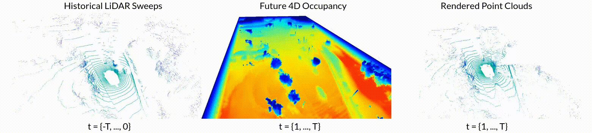

# Point Cloud Forecasting as a Proxy for 4D Occupancy Forecasting
By Tarasha Khurana\*, Peiyun Hu\*, David Held, and Deva Ramanan

\* equal contribution

[project page](https://www.cs.cmu.edu/~tkhurana/ff4d/index.html) | [5-min summary]()

## Citing us
If you find our work useful, please consider citing:
```
@inproceedings{khurana2023point,
  title={Point Cloud Forecasting as a Proxy for 4D Occupancy Forecasting},
  author={Khurana, Tarasha and Hu, Peiyun and Held, David and Ramanan, Deva},
  year={2022},
}
```

## Setup
- Download [nuScenes](https://www.nuscenes.org/nuscenes#download), [KITTI-Odometry](http://www.semantic-kitti.org/dataset.html#download) and [ArgoVerse2.0](https://www.argoverse.org/av2.html#download-link) (code supports the LiDAR dataset, but the change to Sensor dataset is minor). (Tip: See the python scripts to see how to send the file paths.)
- Create a conda environment with the given `environment.yml`. Additionally, install the `chamferdist` package given inside `utils/chamferdist` by navigating to that directory and doing `pip install .`.
- All trained model checkpoints for all three datasets for both 1s and 3s forecasting are available in the `models/` folder.
- The given code has been tested with python3.8, CUDA-11.1.1, CuDNN-v8.0.4.30, GCC-5.5 and NVIDIA GeForce RTX 3090.

## Training
Refer to `train.sh`.

## Testing
Refer to `test.sh` for executing the ray-based evaluation on all points, and `test_fgbg.sh` for evaluation separately on foreground and background points (only supported for nuScenes).

## Ray tracing baseline
The ray tracing baseline is implemented and evaluated by `raytracing_baseline.sh` and `raytracing_baseline_fgbg.sh`.

## Cross-sensor generalization
In order to test a model trained on X on a dataset other than X, change the `dataset` field in the respective model's config.

## Acknowledgments
The `chamferdist` package shipped with this codebase is a version of [this](https://github.com/krrish94/chamferdist) package. Voxel rendering is an adaptation of the raycasting in [our](https://github.com/tarashakhurana/emergent-occ-forecasting) previous work.
